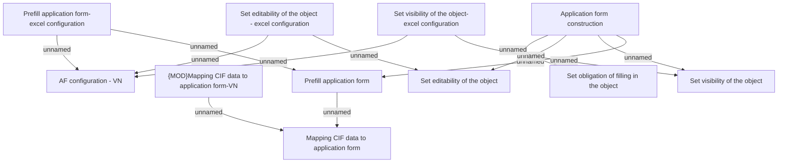

# AF definition - VN

```mermaid
graph TD
    AF_configuration_VN["AF configuration - VN"]
    MOD_Mapping_CIF_data_to_application_form_VN["{MOD}Mapping CIF data to application form-VN"]
    Mapping_CIF_data_to_application_form["Mapping CIF data to application form"]
    Prefill_application_form_excel_configuration["Prefill application form-excel configuration"]
    Set_visibility_of_the_object_excel_configuration["Set visibility of the object-excel configuration"]
    Set_editability_of_the_object_excel_configuration["Set editability of the object - excel configuration"]
    Set_obligation_of_filling_in_the_object["Set obligation of filling in the object"]
    Set_editability_of_the_object["Set editability of the object"]
    Set_visibility_of_the_object["Set visibility of the object"]
    Application_form_construction["Application form construction"]
    Prefill_application_form["Prefill application form"]
    Application_form_construction -->|unnamed| Prefill_application_form
    Prefill_application_form_excel_configuration -->|unnamed| Prefill_application_form
    Set_visibility_of_the_object_excel_configuration -->|unnamed| Set_visibility_of_the_object
    Application_form_construction -->|unnamed| Set_visibility_of_the_object
    Application_form_construction -->|unnamed| Set_editability_of_the_object
    Set_editability_of_the_object_excel_configuration -->|unnamed| Set_editability_of_the_object
    Application_form_construction -->|unnamed| Set_obligation_of_filling_in_the_object
    MOD_Mapping_CIF_data_to_application_form_VN -->|unnamed| Mapping_CIF_data_to_application_form
    Prefill_application_form -->|unnamed| Mapping_CIF_data_to_application_form
    Prefill_application_form_excel_configuration -->|unnamed| AF_configuration_VN
    Set_editability_of_the_object_excel_configuration -->|unnamed| AF_configuration_VN
    Set_visibility_of_the_object_excel_configuration -->|unnamed| AF_configuration_VN
```
