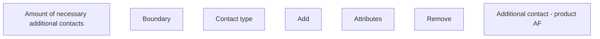

# Additional contact - product AF

```mermaid
graph TD
    Amount_of_necessary_additional_contacts["Amount of necessary additional contacts"]
    el_1019343["Boundary"]
    Contact_type["Contact type"]
    Add["Add"]
    Contact_type["Contact type"]
    Attributes["Attributes"]
    Remove["Remove"]
    Additional_contact_product_AF["Additional contact - product AF"]
```
