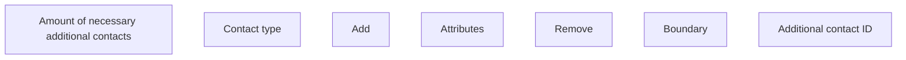

# Additional contact ID

```mermaid
graph TD
    Amount_of_necessary_additional_contacts["Amount of necessary additional contacts"]
    Contact_type["Contact type"]
    Add["Add"]
    Attributes["Attributes"]
    Remove["Remove"]
    Contact_type["Contact type"]
    el_953637["Boundary"]
    Additional_contact_ID["Additional contact ID"]
```
