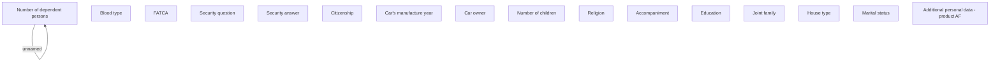

# Additional personal data - product AF

```mermaid
graph TD
    Number_of_dependent_persons["Number of dependent persons"]
    Blood_type["Blood type"]
    FATCA["FATCA"]
    Security_question["Security question"]
    Security_answer["Security answer"]
    Citizenship["Citizenship"]
    Car_s_manufacture_year["Car's manufacture year"]
    Car_owner["Car owner"]
    Number_of_children["Number of children"]
    Religion["Religion"]
    Accompaniment["Accompaniment"]
    Number_of_dependent_persons["Number of dependent persons"]
    Education["Education"]
    Joint_family["Joint family"]
    House_type["House type"]
    Marital_status["Marital status"]
    Additional_personal_data_product_AF["Additional personal data - product AF"]
    Number_of_dependent_persons -->|unnamed| Number_of_dependent_persons
```
