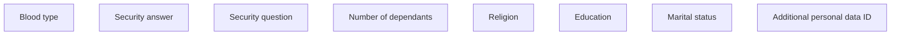

# Additional personal data ID

- **Diagram Type**: Custom
- **Package**: HomerSelect/BSL/Analysis Model/Contract Origination/Fill in application/COMMON for Fill in application/User Interface Model/ID/Personal information ID/Additional personal data ID
- **Diagram ID**: 111791
- **Elements**: 8
- **Connectors**: 0

