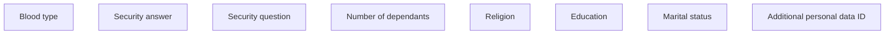

# Additional personal data ID

```mermaid
graph TD
    Blood_type["Blood type"]
    Security_answer["Security answer"]
    Security_question["Security question"]
    Number_of_dependants["Number of dependants"]
    Religion["Religion"]
    Education["Education"]
    Marital_status["Marital status"]
    Additional_personal_data_ID["Additional personal data ID"]
```
