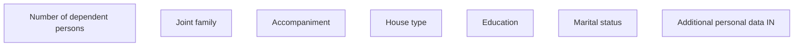

# Additional personal data IN

```mermaid
graph TD
    Number_of_dependent_persons["Number of dependent persons"]
    Joint_family["Joint family"]
    Accompaniment["Accompaniment"]
    House_type["House type"]
    Education["Education"]
    Marital_status["Marital status"]
    Additional_personal_data_IN["Additional personal data IN"]
```
