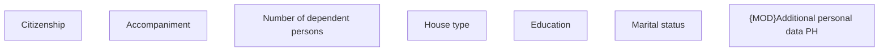

# Additional personal data PH

- **Diagram Type**: Custom
- **Package**: HomerSelect/BSL/Analysis Model/Contract Origination/Fill in application/COMMON for Fill in application/User Interface Model/PH/Personal information PH/Additional personal data PH
- **Diagram ID**: 149328
- **Elements**: 7
- **Connectors**: 0

