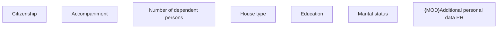

# Additional personal data PH

```mermaid
graph TD
    Citizenship["Citizenship"]
    Accompaniment["Accompaniment"]
    Number_of_dependent_persons["Number of dependent persons"]
    House_type["House type"]
    Education["Education"]
    Marital_status["Marital status"]
    MOD_Additional_personal_data_PH["{MOD}Additional personal data PH"]
```
