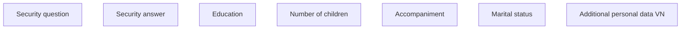

# Additional personal data VN

```mermaid
graph TD
    Security_question["Security question"]
    Security_answer["Security answer"]
    Education["Education"]
    Number_of_children["Number of children"]
    Accompaniment["Accompaniment"]
    Marital_status["Marital status"]
    Additional_personal_data_VN["Additional personal data VN"]
```
