# Application form ID

- **Diagram Type**: Custom
- **Package**: HomerSelect/BSL/Analysis Model/Contract Origination/Fill in application/COMMON for Fill in application/User Interface Model/ID
- **Diagram ID**: 81173
- **Elements**: 14
- **Connectors**: 1

```mermaid
graph TD
    Documents_ID["Documents ID"]
    Payment_information_ID["Payment information ID"]
    Queue_control_panel_product_AF["Queue control panel - product AF"]
    AF_definition_ID["AF definition - ID"]
    Send_to_evaluation["Send to evaluation"]
    Save["Save"]
    Insurance_product_AF["Insurance - product AF"]
    Other_information_ID["Other information ID"]
    Commodities_ID["Commodities ID"]
    Employment_information_ID["Employment information ID"]
    Contact_information_ID["Contact information ID"]
    Header_product_AF["Header - product AF"]
    Personal_information_ID["Personal information ID"]
    Application_form_ID["Application form ID"]
    Application_form_ID -->|unnamed| AF_definition_ID
```

