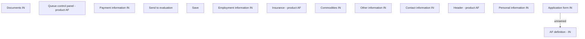

# Application form IN

```mermaid
graph TD
    Documents_IN["Documents IN"]
    Queue_control_panel_product_AF["Queue control panel - product AF"]
    Payment_information_IN["Payment information IN"]
    AF_definition_IN["AF definition - IN"]
    Send_to_evaluation["Send to evaluation"]
    Save["Save"]
    Employment_information_IN["Employment information IN"]
    Insurance_product_AF["Insurance - product AF"]
    Commodities_IN["Commodities IN"]
    Other_information_IN["Other information IN"]
    Contact_information_IN["Contact information IN"]
    Header_product_AF["Header - product AF"]
    Personal_information_IN["Personal information IN"]
    Application_form_IN["Application form IN"]
    Application_form_IN -->|unnamed| AF_definition_IN
```
