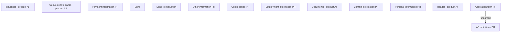

# Application form PH

```mermaid
graph TD
    AF_definition_PH["AF definition - PH"]
    Insurance_product_AF["Insurance - product AF"]
    Queue_control_panel_product_AF["Queue control panel - product AF"]
    Payment_information_PH["Payment information PH"]
    Save["Save"]
    Send_to_evaluation["Send to evaluation"]
    Other_information_PH["Other information PH"]
    Commodities_PH["Commodities PH"]
    Employment_information_PH["Employment information PH"]
    Documents_product_AF["Documents - product AF"]
    Contact_information_PH["Contact information PH"]
    Personal_information_PH["Personal information PH"]
    Header_product_AF["Header - product AF"]
    Application_form_PH["Application form PH"]
    Application_form_PH -->|unnamed| AF_definition_PH
```
