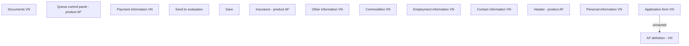

# Application form VN

```mermaid
graph TD
    Documents_VN["Documents VN"]
    Queue_control_panel_product_AF["Queue control panel - product AF"]
    Payment_information_VN["Payment information VN"]
    AF_definition_VN["AF definition - VN"]
    Send_to_evaluation["Send to evaluation"]
    Save["Save"]
    Insurance_product_AF["Insurance - product AF"]
    Other_information_VN["Other information VN"]
    Commodities_VN["Commodities VN"]
    Employment_information_VN["Employment information VN"]
    Contact_information_VN["Contact information VN"]
    Header_product_AF["Header - product AF"]
    Personal_information_VN["Personal information VN"]
    Application_form_VN["Application form VN"]
    Application_form_VN -->|unnamed| AF_definition_VN
```
