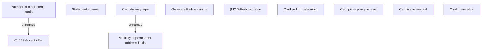

# Card information - product AF

```mermaid
graph TD
    Visibility_of_permanent_address_fields["Visibility of permanent address fields"]
    n_01_158_Accept_offer["01.158 Accept offer"]
    Number_of_other_credit_cards["Number of other credit cards"]
    Statement_channel["Statement channel"]
    Card_delivery_type["Card delivery type"]
    Generate_Emboss_name["Generate Emboss name"]
    MOD_Emboss_name["{MOD}Emboss name"]
    Card_pickup_salesroom["Card pickup salesroom"]
    Card_pick_up_region_area["Card pick-up region area "]
    Card_issue_method["Card issue method"]
    Card_information["Card information"]
    Number_of_other_credit_cards -->|unnamed| n_01_158_Accept_offer
    Card_delivery_type -->|unnamed| Visibility_of_permanent_address_fields
```
