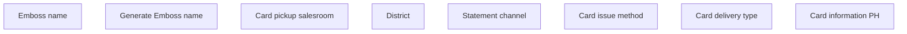

# Card information PH

```mermaid
graph TD
    Emboss_name["Emboss name"]
    Generate_Emboss_name["Generate Emboss name"]
    Card_pickup_salesroom["Card pickup salesroom"]
    District["District"]
    Statement_channel["Statement channel"]
    Card_issue_method["Card issue method"]
    Card_delivery_type["Card delivery type"]
    Card_information_PH["Card information PH"]
```
