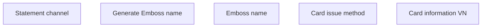

# Card information VN

```mermaid
graph TD
    Statement_channel["Statement channel"]
    Generate_Emboss_name["Generate Emboss name"]
    Emboss_name["Emboss name"]
    Card_issue_method["Card issue method"]
    Card_information_VN["Card information VN"]
```
