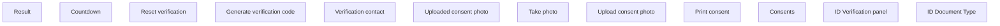

# Client consent ID

```mermaid
graph TD
    Result["Result"]
    Countdown["Countdown"]
    Reset_verification["Reset verification"]
    Generate_verification_code["Generate verification code"]
    Verification_contact["Verification contact"]
    Uploaded_consent_photo["Uploaded consent photo"]
    Take_photo["Take photo"]
    Upload_consent_photo["Upload consent photo"]
    Print_consent["Print consent"]
    Consents["Consents"]
    ID_Verification_panel["ID Verification panel"]
    ID_Document_Type["ID Document Type"]
```
