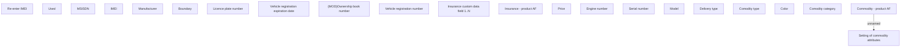

# Commodity - product AF

```mermaid
graph TD
    Setting_of_commodity_attributes["Setting of commodity attributes"]
    Re_enter_IMEI["Re-enter IMEI"]
    Used["Used"]
    MSISDN["MSISDN"]
    IMEI["IMEI"]
    Manufacturer["Manufacturer"]
    el_1721997["Boundary"]
    Licence_plate_number["Licence plate number"]
    Vehicle_registration_expiration_date["Vehicle registration expiration date"]
    MOD_Ownership_book_number["{MOD}Ownership book number"]
    Vehicle_registration_number["Vehicle registration number"]
    Insurance_custom_data_field_1_N["Insurance custom data field 1..N"]
    Insurance_product_AF["Insurance - product AF"]
    Price["Price"]
    Engine_number["Engine number"]
    Serial_number["Serial number"]
    Model["Model"]
    Manufacturer["Manufacturer"]
    Delivery_type["Delivery type"]
    Comodity_type["Comodity type"]
    Color["Color"]
    Comodity_category["Comodity category"]
    Commodity_product_AF["Commodity - product AF"]
    Commodity_product_AF -->|unnamed| Setting_of_commodity_attributes
```
