# Commodity PH

- **Diagram Type**: Custom
- **Package**: HomerSelect/BSL/Analysis Model/Contract Origination/Fill in application/COMMON for Fill in application/User Interface Model/PH/Commodities PH/Commodity PH
- **Diagram ID**: 144561
- **Elements**: 12
- **Connectors**: 0

```mermaid
graph TD
    IMEI["IMEI"]
    Delivery_Type["Delivery Type"]
    Manufacturer["Manufacturer"]
    Price["Price"]
    Engine_number["Engine number"]
    Serial_number["Serial number"]
    Model["Model"]
    Color["Color"]
    Manufacturer["Manufacturer"]
    Commodity_type["Commodity type"]
    Commodity_category["Commodity category"]
    Commodity_PH["Commodity PH"]
```

