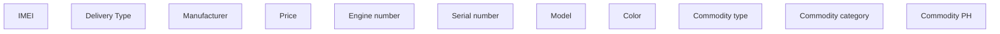

# Commodity PH

```mermaid
graph TD
    IMEI["IMEI"]
    Delivery_Type["Delivery Type"]
    Manufacturer["Manufacturer"]
    Price["Price"]
    Engine_number["Engine number"]
    Serial_number["Serial number"]
    Model["Model"]
    Color["Color"]
    Manufacturer["Manufacturer"]
    Commodity_type["Commodity type"]
    Commodity_category["Commodity category"]
    Commodity_PH["Commodity PH"]
```
