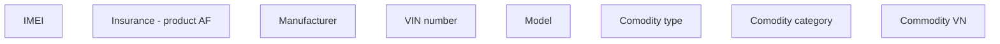

# Commodity VN

```mermaid
graph TD
    IMEI["IMEI"]
    Insurance_product_AF["Insurance - product AF"]
    Manufacturer["Manufacturer"]
    VIN_number["VIN number"]
    Model["Model"]
    Comodity_type["Comodity type"]
    Comodity_category["Comodity category"]
    Commodity_VN["Commodity VN"]
```
