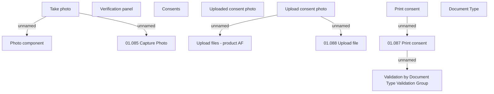

# Common panel for consent - product AF

- **Diagram Type**: Custom
- **Package**: HomerSelect/BSL/Analysis Model/Contract Origination/Fill in application/COMMON for Fill in application/User Interface Model/COMMON for User Interface/Common panel for consent - product AF
- **Diagram ID**: 158050
- **Elements**: 13
- **Connectors**: 6

