# Common panel for document - product AF

- **Diagram Type**: Custom
- **Package**: HomerSelect/BSL/Analysis Model/Contract Origination/Fill in application/COMMON for Fill in application/User Interface Model/COMMON for User Interface/Document panel
- **Diagram ID**: 153788
- **Elements**: 24
- **Connectors**: 10

```mermaid
graph TD
    Page_specification["Page specification"]
    MOD_Validation_result["{MOD}Validation result"]
    Taken_photo_uploaded_photo["Taken photo/uploaded photo"]
    Remove["Remove"]
    Take_photo["Take photo"]
    Upload_photo["Upload photo"]
    Page_specification_panel["Page specification panel"]
    MOD_Validation_of_photo_is_in_progress["{MOD}Validation of photo is in progress"]
    Photo_component["Photo component"]
    Document_prefill_rule["Document prefill rule"]
    n_01_088_Upload_file["01.088 Upload file"]
    Photo_acquiring_type_priority["Photo acquiring type priority"]
    Photo_preview["Photo preview"]
    Document_type["Document type"]
    Add["Add"]
    Photo_Taking_Result["Photo Taking Result"]
    Document_management["Document management"]
    n_01_085_Capture_Photo["01.085 Capture Photo"]
    Document_attribute_COUNTRY["Document attribute COUNTRY"]
    Upload_files_product_AF["Upload files - product AF"]
    Attribute["Attribute"]
    Document_type["Document type"]
    Document["Document"]
    Necessary_documents["Necessary documents"]
    Upload_photo -->|unnamed| Upload_files_product_AF
    Attribute -->|unnamed| Document_attribute_COUNTRY
    Take_photo -->|unnamed| n_01_085_Capture_Photo
    Remove -->|unnamed| Document_management
    Document_type -->|unnamed| Document_management
    Add -->|unnamed| Document_management
    Document -->|unnamed| Photo_acquiring_type_priority
    Upload_photo -->|unnamed| n_01_088_Upload_file
    Attribute -->|unnamed| Document_prefill_rule
    Take_photo -->|unnamed| Photo_component
```

