# Contact information - product AF

- **Diagram Type**: Custom
- **Package**: HomerSelect/BSL/Analysis Model/Contract Origination/Fill in application/COMMON for Fill in application/User Interface Model/Product/Contact information - product AF
- **Diagram ID**: 150063
- **Elements**: 16
- **Connectors**: 0

```mermaid
graph TD
    Remittance_product_AF["Remittance - product AF"]
    Remitter["Remitter"]
    Place_of_birth["Place of birth"]
    Date_of_birth["Date of birth"]
    National_identification_number["National identification number"]
    Amount_of_necessary_related_persons["Amount of necessary related persons"]
    Add["Add"]
    Remove["Remove"]
    Phone_number_2["Phone number 2"]
    Phone_number_1["Phone number 1"]
    Name2["Name2"]
    Name3["Name3"]
    Name1["Name1"]
    Relation_type["Relation type"]
    Related_person["Related person"]
    Contact_information_product_AF["Contact information - product AF"]
```

