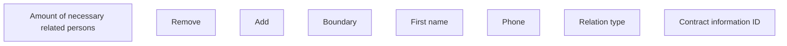

# Contact information ID

```mermaid
graph TD
    Amount_of_necessary_related_persons["Amount of necessary related persons"]
    Remove["Remove"]
    Add["Add"]
    el_1113793["Boundary"]
    First_name["First name"]
    Phone["Phone"]
    Relation_type["Relation type"]
    Contract_information_ID["Contract information ID"]
```
