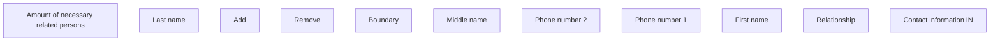

# Contact information IN

- **Diagram Type**: Custom
- **Package**: HomerSelect/BSL/Analysis Model/Contract Origination/Fill in application/COMMON for Fill in application/User Interface Model/IN/Contact information IN
- **Diagram ID**: 148509
- **Elements**: 11
- **Connectors**: 0

