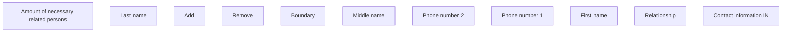

# Contact information IN

```mermaid
graph TD
    Amount_of_necessary_related_persons["Amount of necessary related persons"]
    Last_name["Last name"]
    Add["Add"]
    Remove["Remove"]
    el_1724570["Boundary"]
    Middle_name["Middle name"]
    Phone_number_2["Phone number 2"]
    Phone_number_1["Phone number 1"]
    First_name["First name"]
    Relationship["Relationship"]
    Contact_information_IN["Contact information IN"]
```
