# Contact information PH

- **Diagram Type**: Custom
- **Package**: HomerSelect/BSL/Analysis Model/Contract Origination/Fill in application/COMMON for Fill in application/User Interface Model/PH/Contact information PH
- **Diagram ID**: 157657
- **Elements**: 12
- **Connectors**: 0

```mermaid
graph TD
    Amount_of_necessary_related_persons["Amount of necessary related persons"]
    Last_name["Last name"]
    Remove["Remove"]
    Remittance_PH["Remittance PH"]
    Remitter["Remitter"]
    DEL_Phone["{DEL}Phone"]
    Middle_name["Middle name"]
    First_name["First name"]
    Relation_type["Relation type"]
    Add["Add"]
    Related_person["Related person"]
    Contact_information_PH["Contact information PH"]
```

