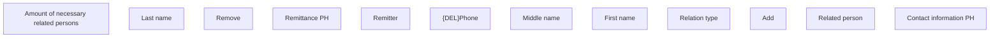

# Contact information PH

```mermaid
graph TD
    Amount_of_necessary_related_persons["Amount of necessary related persons"]
    Last_name["Last name"]
    Remove["Remove"]
    Remittance_PH["Remittance PH"]
    Remitter["Remitter"]
    DEL_Phone["{DEL}Phone"]
    Middle_name["Middle name"]
    First_name["First name"]
    Relation_type["Relation type"]
    Add["Add"]
    Related_person["Related person"]
    Contact_information_PH["Contact information PH"]
```
