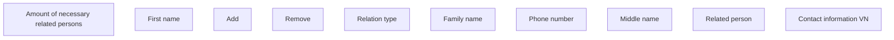

# Contact information VN

- **Diagram Type**: Custom
- **Package**: HomerSelect/BSL/Analysis Model/Contract Origination/Fill in application/COMMON for Fill in application/User Interface Model/VN/Contact information VN
- **Diagram ID**: 128957
- **Elements**: 10
- **Connectors**: 0

