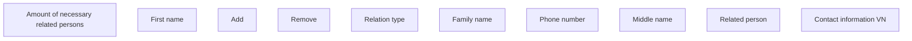

# Contact information VN

```mermaid
graph TD
    Amount_of_necessary_related_persons["Amount of necessary related persons"]
    First_name["First name"]
    Add["Add"]
    Remove["Remove"]
    Relation_type["Relation type"]
    Family_name["Family name"]
    Phone_number["Phone number"]
    Middle_name["Middle name"]
    Related_person["Related person"]
    Contact_information_VN["Contact information VN"]
```
