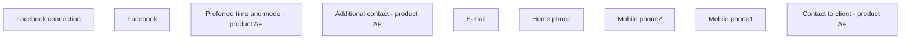

# Contact to client - product AF

```mermaid
graph TD
    Facebook_connection["Facebook connection"]
    Facebook["Facebook"]
    Preferred_time_and_mode_product_AF["Preferred time and mode - product AF"]
    Additional_contact_product_AF["Additional contact - product AF"]
    E_mail["E-mail"]
    Home_phone["Home phone"]
    Mobile_phone2["Mobile phone2"]
    Mobile_phone1["Mobile phone1"]
    Contact_to_client_product_AF["Contact to client - product AF"]
```
