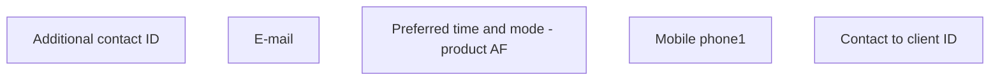

# Contact to client ID

```mermaid
graph TD
    Additional_contact_ID["Additional contact ID"]
    E_mail["E-mail"]
    Preferred_time_and_mode_product_AF["Preferred time and mode - product AF"]
    Mobile_phone1["Mobile phone1"]
    Contact_to_client_ID["Contact to client ID"]
```
