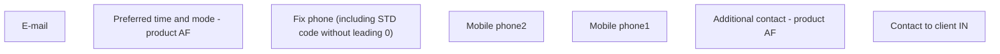

# Contact to client IN

```mermaid
graph TD
    E_mail["E-mail"]
    Preferred_time_and_mode_product_AF["Preferred time and mode - product AF"]
    Fix_phone_including_STD_code_without_leading_0["Fix phone (including STD code without leading 0)"]
    Mobile_phone2["Mobile phone2"]
    Mobile_phone1["Mobile phone1"]
    Additional_contact_product_AF["Additional contact - product AF"]
    Contact_to_client_IN["Contact to client IN"]
```
