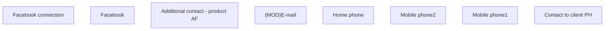

# Contact to client PH

- **Diagram Type**: Custom
- **Package**: HomerSelect/BSL/Analysis Model/Contract Origination/Fill in application/COMMON for Fill in application/User Interface Model/PH/Personal information PH/Contact to client PH
- **Diagram ID**: 157368
- **Elements**: 8
- **Connectors**: 0

