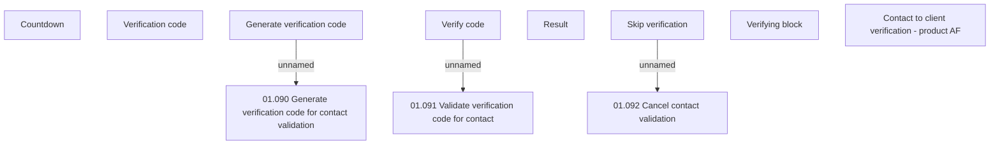

# Contact to client verification - product AF

- **Diagram Type**: Custom
- **Package**: HomerSelect/BSL/Analysis Model/Contract Origination/Fill in application/COMMON for Fill in application/User Interface Model/Product/Personal information - product AF/Contact to client verification - product AF
- **Diagram ID**: 129435
- **Elements**: 11
- **Connectors**: 3

