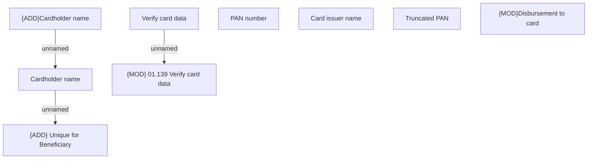

# Disbursement to card - product AF

```mermaid
graph TD
    Cardholder_name["Cardholder name"]
    ADD_Unique_for_Beneficiary["{ADD} Unique for Beneficiary
"]
    ADD_Cardholder_name["{ADD}Cardholder name"]
    MOD_01_139_Verify_card_data["{MOD} 01.139 Verify card data"]
    Verify_card_data["Verify card data"]
    PAN_number["PAN number"]
    Card_issuer_name["Card issuer name"]
    Truncated_PAN["Truncated PAN"]
    MOD_Disbursement_to_card["{MOD}Disbursement to card"]
    Verify_card_data -->|unnamed| MOD_01_139_Verify_card_data
    Cardholder_name -->|unnamed| ADD_Unique_for_Beneficiary
    ADD_Cardholder_name -->|unnamed| Cardholder_name
```
