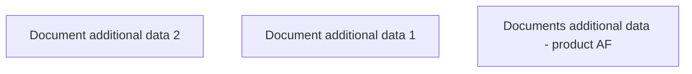

# Document additional data - product AF

- **Diagram Type**: Custom
- **Package**: HomerSelect/BSL/Analysis Model/Contract Origination/Fill in application/COMMON for Fill in application/User Interface Model/Product/Documents - product AF/Document additional data - product AF
- **Diagram ID**: 63617
- **Elements**: 3
- **Connectors**: 0

