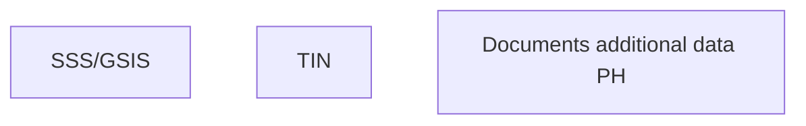

# Documents additional data PH

- **Diagram Type**: Custom
- **Package**: HomerSelect/BSL/Analysis Model/Contract Origination/Fill in application/COMMON for Fill in application/User Interface Model/PH/Documents PH/Documents additional data PH
- **Diagram ID**: 124046
- **Elements**: 3
- **Connectors**: 0

