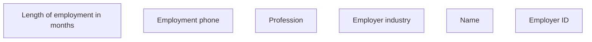

# Employer ID

```mermaid
graph TD
    Length_of_employment_in_months["Length of employment in months"]
    Employment_phone["Employment phone"]
    Profession["Profession"]
    Employer_industry["Employer industry"]
    Name["Name"]
    Employer_ID["Employer ID"]
```
