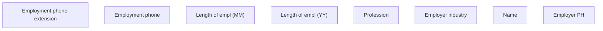

# Employer PH

```mermaid
graph TD
    Employment_phone_extension["Employment phone extension"]
    Employment_phone["Employment phone"]
    Length_of_empl_MM["Length of empl (MM)"]
    Length_of_empl_YY["Length of empl (YY)"]
    Profession["Profession"]
    Employer_industry["Employer industry"]
    Name["Name"]
    Employer_PH["Employer PH"]
```
