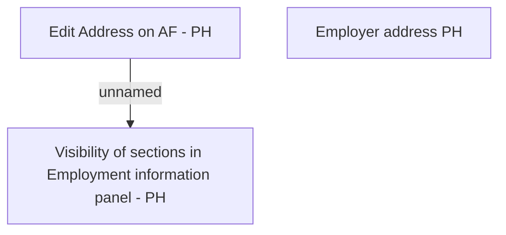

# Employer address PH

```mermaid
graph TD
    Visibility_of_sections_in_Employment_information_panel_PH["Visibility of sections in Employment information panel - PH"]
    Edit_Address_on_AF_PH["Edit Address on AF - PH"]
    Employer_address_PH["Employer address PH"]
    Edit_Address_on_AF_PH -->|unnamed| Visibility_of_sections_in_Employment_information_panel_PH
```
