# Employer/University IN

- **Diagram Type**: Custom
- **Package**: HomerSelect/BSL/Analysis Model/Contract Origination/Fill in application/COMMON for Fill in application/User Interface Model/IN/Employment information IN/Employer/University IN
- **Diagram ID**: 88623
- **Elements**: 11
- **Connectors**: 0

```mermaid
graph TD
    el_1107627["Boundary"]
    Employed_Studing_from_MMYY["Employed/Studing from (MMYY)"]
    University_course["University course"]
    Employment_University_phone["Employment/University phone"]
    Employment_University_phone_extension["Employment/University phone extension"]
    Department_and_Designation["Department and Designation"]
    Name["Name"]
    Employment_University_phone_ownership["Employment/University phone ownership "]
    Employer_industry["Employer industry"]
    Profession["Profession"]
    Employer_University_IN["Employer/University IN"]
```

