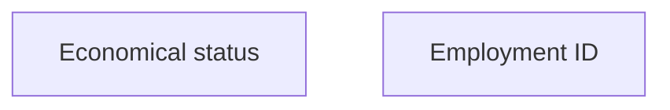

# Employment ID

- **Diagram Type**: Custom
- **Package**: HomerSelect/BSL/Analysis Model/Contract Origination/Fill in application/COMMON for Fill in application/User Interface Model/ID/Employment information ID/Employment ID
- **Diagram ID**: 93648
- **Elements**: 2
- **Connectors**: 0

