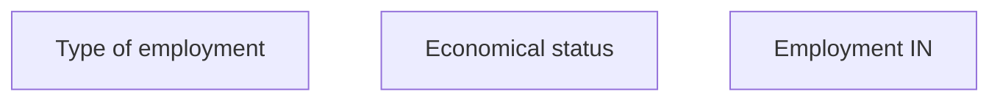

# Employment IN

- **Diagram Type**: Custom
- **Package**: HomerSelect/BSL/Analysis Model/Contract Origination/Fill in application/COMMON for Fill in application/User Interface Model/IN/Employment information IN/Employment IN
- **Diagram ID**: 88624
- **Elements**: 3
- **Connectors**: 0

