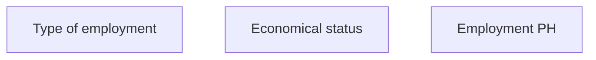

# Employment PH

- **Diagram Type**: Custom
- **Package**: HomerSelect/BSL/Analysis Model/Contract Origination/Fill in application/COMMON for Fill in application/User Interface Model/PH/Employment information PH/Employment PH
- **Diagram ID**: 79590
- **Elements**: 3
- **Connectors**: 0

