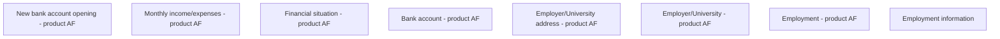

# Employment information - product AF

```mermaid
graph TD
    New_bank_account_opening_product_AF["New bank account opening - product AF"]
    Monthly_income_expenses_product_AF["Monthly income/expenses - product AF"]
    Financial_situation_product_AF["Financial situation - product AF"]
    Bank_account_product_AF["Bank account - product AF"]
    Employer_University_address_product_AF["Employer/University address - product AF"]
    Employer_University_product_AF["Employer/University - product AF"]
    Employment_product_AF["Employment - product AF"]
    Employment_information["Employment information"]
```
