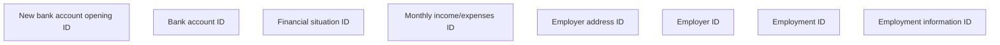

# Employment information ID

- **Diagram Type**: Custom
- **Package**: HomerSelect/BSL/Analysis Model/Contract Origination/Fill in application/COMMON for Fill in application/User Interface Model/ID/Employment information ID
- **Diagram ID**: 154025
- **Elements**: 8
- **Connectors**: 0

