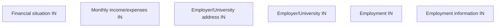

# Employment information IN

```mermaid
graph TD
    Financial_situation_IN["Financial situation IN"]
    Monthly_income_expenses_IN["Monthly income/expenses IN"]
    Employer_University_address_IN["Employer/University address IN"]
    Employer_University_IN["Employer/University IN"]
    Employment_IN["Employment IN"]
    Employment_information_IN["Employment information IN"]
```
